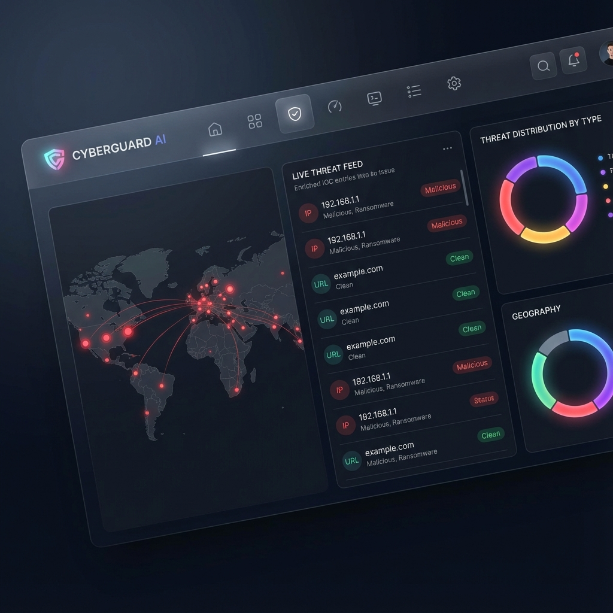

# IOC Enrichment & Correlation Tool


## 🔎 Background & Motivation
The **IOC Enrichment & Correlation Tool** is a powerful cybersecurity utility designed to automate the analysis and enrichment of Indicators of Compromise (IOCs). By integrating with multiple threat intelligence providers, it provides security analysts with a unified view of potential threats.

This tool streamlines the workflow for SOC analysts, incident responders, and threat hunters by offering:
- **Automated Enrichment**: Fetching data from trusted sources like VirusTotal, Shodan, AbuseIPDB, and AlienVault OTX.
- **Multiple Interfaces**: Choose between a Command-Line Interface (CLI), a real-time Web Dashboard, a Directory Watcher, or a REST API.
- **Broad Support**: Handles various IOC types including IPs, Domains, and Hashes.

## 🎬 Demo
[](https://youtu.be/z63Pb1SQjEI)

*Click the image above to watch the walkthrough on YouTube.*

## ✨ Features

### 🛡️ Supported IOC Types
- **IP Addresses**: IPv4 and IPv6.
- **Domains**: Standard domain names.
- **Hashes**: MD5, SHA1, and SHA256 file hashes.

### 🌐 Enrichment Sources
The tool integrates with the following services (API keys required):
- **VirusTotal**: Malicious file detection and URL scanning.
- **Shodan**: Internet-connected device search and vulnerability analysis.
- **AbuseIPDB**: IP abuse reporting and checking.
- **AlienVault OTX**: Open Threat Exchange data.

### 💻 Multiple Interfaces
1.  **Command-Line Interface (CLI)**: For quick, scriptable enrichment tasks.
2.  **Web Dashboard (Flask)**: A modern UI for file uploads and visual results.
    
    

3.  **Directory Watcher**: Automated processing of files dropped into a specific folder.
4.  **REST API (FastAPI)**: High-performance endpoint for integration with other tools (SOAR, SIEM).

### 📤 Flexible Output Formats
Export your enriched data in formats suitable for various use cases:
- **JSON**: Detailed nested structure for programmatic use.
- **CSV**: Flat format for spreadsheet analysis.
- **Markdown**: Human-readable reports.
- **Splunk**: Formatted explicitly for ingestion into Splunk.

---

## 🚀 Installation & Setup

### 1. Clone the Repository
```bash
git clone [YOUR_REPO_URL]
cd ioc-enricher
```

### 2. Create a Virtual Environment
It is recommended to use a virtual environment to manage dependencies.

**Windows (PowerShell):**
```powershell
python -m venv venv
.\venv\Scripts\Activate.ps1
```

**Linux/macOS:**
```bash
python3 -m venv venv
source venv/bin/activate
```

### 3. Install Dependencies
```bash
pip install -r requirements.txt
```

### 4. Configure API Keys
Create a `.env` file in the project's root directory to store your API keys.

```ini
# .env file
VT_API_KEY="your_virustotal_api_key"
SHODAN_API_KEY="your_shodan_api_key"
ABUSEIPDB_API_KEY="your_abuseipdb_api_key"
OTX_API_KEY="your_otx_api_key"
```

---

## 📖 Usage Guide

### 1. Command-Line Interface (CLI)
Enrich a file containing IOCs and save the result.

```bash
# Basic usage
python main.py enrich examples/input_iocs.json

# Specify output format and file
python main.py enrich examples/input_iocs.json --output-format csv --output-file output/results.csv
```

**Options:**
- `--output-format`: `json` (default), `csv`, `markdown`, `splunk`.
- `--output-file`: Path to save the output.

### 2. Web Dashboard
Launch the web interface to upload files and view results in real-time.

```bash
python app.py
```
Open your browser and navigate to: `http://127.0.0.1:5000`

### 3. Directory Watcher
Automatically process any file dropped into the `watch/` directory.

```bash
python watcher.py
```
1. Run the script.
2. Drop a JSON or CSV file into the `watch/` folder.
3. Enriched results will appear in the `output/` folder.

### 4. REST API
Start the API server for programmatic access.

```bash
uvicorn api:app --reload
```
- **API URL**: `http://127.0.0.1:8000`
- **Documentation**: `http://127.0.0.1:8000/docs` (Swagger UI)

---

## 📂 Input & Output Formats

### Input Structure
The tool supports **JSON** and **CSV** files.

**JSON Example (`examples/input_iocs.json`):**
```json
{
  "iocs": [
    "8.8.8.8",
    "google.com",
    "44d88612fea8a8f36de82e1278abb02f"
  ]
}
```

**CSV Example:**
```csv
8.8.8.8
google.com
44d88612fea8a8f36de82e1278abb02f
```
*(The first column is read as the IOC)*

### Output Location
By default, results are printed to the console unless an output file is specified. The `watch` and `web` modes typically save to the `output/` directory.

---

## 🏗️ Project Structure
```
ioc-enricher/
├── api.py              # FastAPI application
├── app.py              # Flask web dashboard
├── main.py             # CLI entry point
├── watcher.py          # Directory watcher script
├── enrichers/          # Modules for each threat intel source
├── formatters/         # Output formatting logic
├── utils/              # Helper functions (parsing, classification)
├── templates/          # HTML templates for the dashboard
├── watch/              # Directory for the watcher to monitor
├── output/             # Default output directory
└── requirements.txt    # Project dependencies
```

## 🤝 Contributing
Contributions are welcome! Please feel free to submit a Pull Request.

